# summer.md ランダム性検証（2026-07-30）

> 2026-08-01追記: 1〜9節は、完成カードをチャット層で抽選する旧方式の履歴として残す。
> Google FlowとChatGPTの一発生成でCard1へ高頻度に戻る実利用報告を受け、
> 旧`SUMMER10-BAG-v3`を同日廃止した。現在の②は、最初の`random/`に近い
> 顔・体型・髪・短いシーン束・カメラの5リストだけを持つ軽量版。詳細は10節。

## 目的

`season/summer.md` の直接投げ版を同じ条件で複数回生成し、画像モデルの自己選択に
見た目の偏りが出るかを確認する。偏りがあればプロンプトを修正し、6〜12枚規模で再確認する。

生成には Codex の組み込み画像生成を使用した。すべて参照画像なしの新規生成。

## 1. 変更前

変更前の「自己完結文章版」を、文面を変えず独立に6回生成した。

観察結果:

| 軸 | 結果 |
|---|---|
| 服装 | 浴衣 4/6 |
| 場面 | 車窓・窓辺 3/6、祭り 2/6 |
| 距離 | 全身・遠景 0/6。すべて人物が大きい縦ポートレート |
| 髪 | 暗色のまとめ髪 5/6 |
| 視線 | 画面外・右上を見る構図 5/6 |
| フィルム | 1枚の光漏れ以外は近い細粒子・暖色系（現行版では光漏れを廃止） |

浴衣が本当に6択の一様抽選なら、6枚中4枚以上になる確率は約0.87%。
髪型が本当に6択の一様抽選なら、特定の1型が6枚中5枚以上になる確率は約0.066%。
選択番号を出さない方式なので正式な統計検定ではないが、実用上は強い収束と判断した。

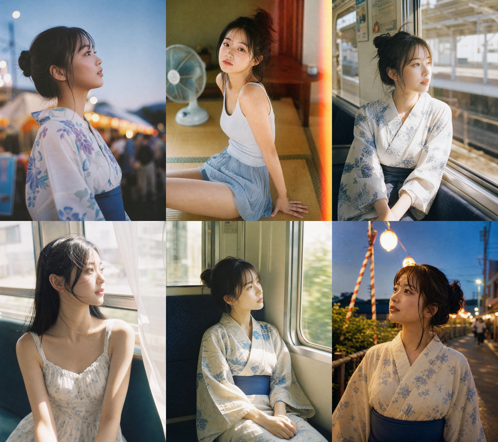

## 2. 改善途中で分かったこと

場面・服・髪・時間・構図を6レーンへ分け、同じプロンプト内で
`DIVERSITY_LANE=1`〜`6`を指定する方式を4枚試した。

結果は4枚中2枚で指定レーンを無視した。

- レーン3（祭り）指定 → レーン2（部屋と扇風機）を描画
- レーン4（車窓）指定 → レーン5（自転車）を描画

画像モデルへ全候補を同時に見せる限り、番号指定だけでも選択段階の偏りを除けない。

次に6レーンを別々の完成プロンプトへ分け、各1枚を生成したところ、
主要指定は6/6で守られた。しかし、この方法はユーザーが生成前にプロンプトを
選び分ける必要があり、「同じ1ブロックを毎回そのまま貼る」直接投げ版の要件を満たさない。
そのため、これはカード内容の描画可能性を確認した診断結果としてのみ残し、最終方式には採用しない。

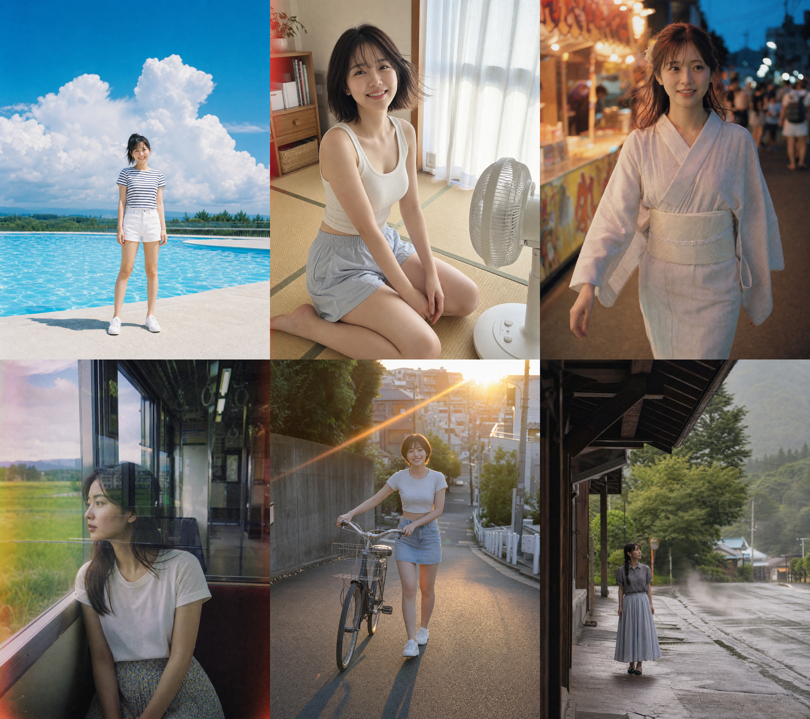

8枚の完成カードを1ブロックへ戻して、その全体を低レベル画像モデルへ直接渡す方式も4枚試した。
結果はカード1（プール）が3/4、カード2（畳・扇風機）が1/4で、先頭カードへ収束した。
「内部で公平なコインを3回」と書くだけでは、画像モデル自身に選択を任せられない。

## 3. 1ブロックのままチャット層で選択

この時点の改善版は、ユーザーが貼る文面を1ブロックに保ったまま、次の順で処理する。

1. ChatGPT / Gemini などのチャットAIが、8枚の完成カードから1枚だけをサイレント抽選する
2. 過去画像が見える場合は、8枚をシャッフルバッグとして扱い、使用済みカードを除く
3. チャットAIは「選択カード本文＋共通条件」だけを画像生成ツールへ渡す
4. 画像生成ツールは1枚だけ作り、カード番号や説明は表示しない

ユーザー側で番号、seed、レーン、別プロンプトを指定する必要はない。
同じコードブロックを、同じ会話で毎回そのまま貼る。

### 実生成テスト

独立した4つの実行コンテキストで1回目を生成し、各コンテキストでもう一度
同じブロックを実行した。合計8枚。

| 系列 | 1回目 | 同じ会話の2回目 | 直前との重複 |
|---|---:|---:|---|
| A | 1 プール | 7 かき氷 | なし |
| B | 1 プール | 8 縁側・浴衣 | なし |
| C | 6 雨上がり | 4 帰省電車 | なし |
| D | 2 畳・扇風機 | 4 帰省電車 | なし |

観察結果:

| 軸 | 結果 |
|---|---|
| カード網羅 | 8枚で6種。最多はカード1と4の各2/8 |
| 3アンカー | 場所・服・撮影距離が8/8で選択カードと一致 |
| 同一会話の即時反復 | 0/4。4系列すべて2回目が別カード |
| 服装 | 6種。浴衣1/8 |
| 場面 | 6種。車窓2/8、祭り0/8 |
| 距離 | 全身・遠景4/8、膝上1/8、胸上1/8、腰上2/8 |
| 髪 | 高いポニーテール、短いボブ、三つ編み、肩まで、低いひとつ結び、長い下ろし髪 |

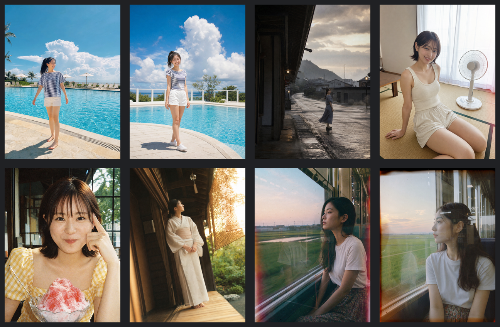

新規コンテキストの初回選択は `1, 1, 6, 2` で、カード1が2/4だった。
したがって、初回から真の一様抽選になったとは主張しない。一方、同じ会話での
シャッフルバッグは4/4で直前の反復を防ぎ、8枚全体の見た目も6種へ分散した。

## 4. シード式の監査

変更前の式は、全スロットへ同じ `SEED + n * 7` を使っていた。
このため候補数が同じスロット間に固定相関が生まれた。

- 8項目スロットでは `B=I`、`D=M` が常に成立
- 10項目スロットでは A・C-2・G が固定した位置関係になる
- 全組み合わせは `SEED mod 2520` の2,520通りで一巡
- 同じシードから3案を作る規則に案番号がなく、3案の非重複指定と衝突
- 無効値を「最も近い番号」へ直す規則は、同距離時の扱いがなく再現不能

修正版は、有効候補を先に絞ってから状態を進め、その候補内の位置を選ぶ。
複数案でも状態を初期化しないため、1つのシードから別の案を再現可能にした。

## 5. 追加4枚と赤いモヤの除去

修正前の最終8枚を原寸で見直すと、画面端を覆う赤・橙系の半透明な帯や霧が3/8にあった。

- カード2の1枚: `片端だけに弱い赤い光漏れ` が直接描画された
- カード4の2枚: `期限切れフィルムの色ずれ` が色付きの縁として描画された

対策として、P4を中立色の細粒子フィルムへ、P2を穏やかな退色とクリーンな画面端へ変更した。
カード2・4の完成カードも同じ方向へ直し、全カード共通へ色付き光漏れ・色霧を使わない指定を追加した。

修正版の同じ1ブロックを、1つの会話で4回連続実行した。外部seed・番号指定・レーン指定は使わず、
シャッフルバッグの抽選順は `3 → 1 → 5 → 2` だった。

| 軸 | 追加4枚の結果 |
|---|---|
| カード | 4種。再利用0/4 |
| 3アンカー | 12項目中10項目が完全一致、2項目が部分一致、矛盾0 |
| 即時反復 | 0/3 |
| 赤・橙・マゼンタの画面端モヤ | 0/4 |

部分一致は、カード3の腰上構図では服アンカーに含めたサンダルが画面外だったことと、
カード2が膝上指定より広い座り全身構図になったこと。4枚ともカード自体は一意に判別できた。

旧8枚と追加4枚の選択結果を参考集計すると、カード1〜8をすべて網羅した。

`1: 3枚 / 2: 2枚 / 3: 1枚 / 4: 2枚 / 5: 1枚 / 6: 1枚 / 7: 1枚 / 8: 1枚`

最多はカード1の3/12。追加4枚で赤いモヤが再発しなかったことは確認できたが、
修正前8枚と修正後4枚はプロンプト版が異なるため、色表現の比率は一つの母集団として扱わない。

カード4はランダム12枚の集計外で単独回帰生成し、車窓・白Tシャツとロングスカート・
腰上横顔を保ったまま、色付きの画面端モヤが出ないことを確認した。

次の一覧は、上段左から追加カード3・1・5、下段左から追加カード2・カード4回帰確認。

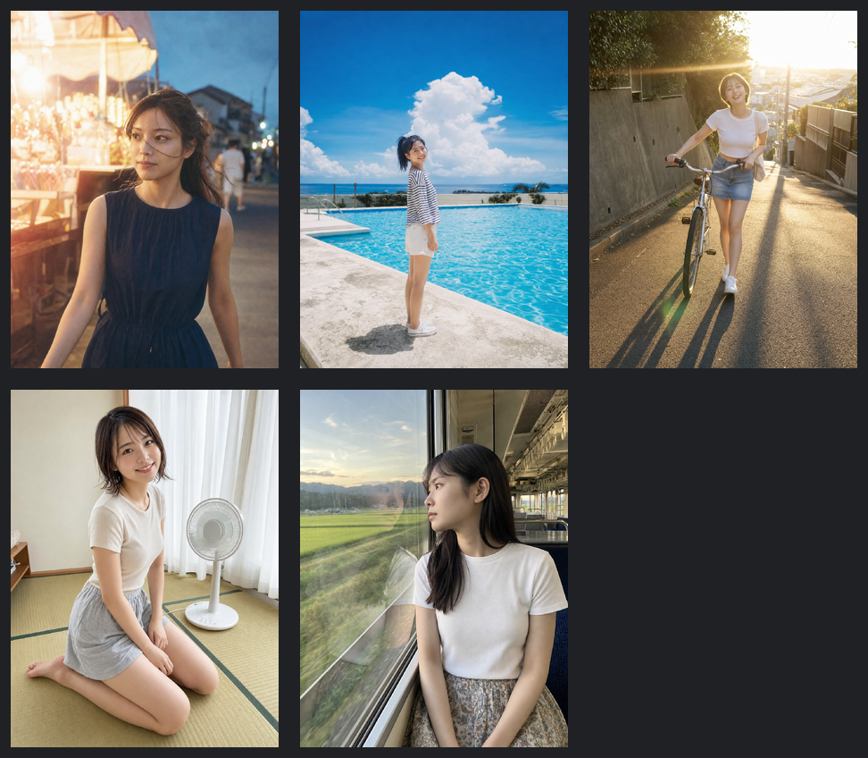

## 6. 骨格カード＋小さな可変要素

完成カードだけでは、カードが再登場したときに同じ顔・髪色・瞬間・質感へ戻りやすい。
そこで、場所・服・撮影距離・髪型・主動作・光・フィルム系統は8枚の骨格カードで固定し、
カードを選んだ後にだけ次の4軸を追加抽選するハイブリッド版へ変更した。

- A 顔立ち: 4種
- C 髪色: 4種
- R 撮る瞬間: 3種
- T フィルム／光学表現の効き方: 2種

1カードあたり `4 × 4 × 3 × 2 = 96` 通り、8カード全体では768通りの
ラベル付き組み合わせになる。ただし、遠景では顔差が読めないなど、
768通りがそのまま768種類の見た目になるわけではない。

ユーザーが貼るコードブロックは引き続き1つだけ。チャットAIが骨格カードとA/C/R/Tを選び、
候補一覧や未選択カードを含めず、具体記述へ展開済みの最終プロンプトだけを
低レベル画像モデルへ渡す。

### ランダム4枚

4枚の骨格カードとA/C/R/Tを先に抽選し、見栄えや網羅性を理由に選び直さず生成した。

| 画像 | 抽選結果 |
|---|---|
| R1 | Card4 / A2 / C3 / R2 / T2 |
| R2 | Card2 / A4 / C1 / R3 / T2 |
| R3 | Card5 / A4 / C1 / R3 / T1 |
| R4 | Card6 / A2 / C2 / R3 / T1 |

| 軸 | 結果 |
|---|---|
| 骨格カード | 4種。再利用0/4、カード判別4/4 |
| 3アンカー | 12項目中9項目が一致、3項目が部分一致、矛盾0 |
| A/C/R/T | 16項目中9項目が一致、4項目が部分一致、3項目が遠景等で判定不能、矛盾0 |
| 他カード要素の混在 | 0/4 |
| 赤・橙・マゼンタの画面端モヤ | 0/4 |

部分一致は、Card4が腰上より少し広かったことと、Card6が雨上がりより降雨中に見え、
人物が画面高の約4割で3分の1以下にならなかったこと。Card6は背面3/4寄りでもあり、
共通禁止に触れた。

R2の初回出力は完全なモノクロになったため、全カード共通へ自然なカラー写真の固定を追加し、
Card2 / A4 / C1 / R3 / T2を変えずに再生成した。採用画像は黒髪、青灰色の服、
黄褐色の畳、緑の畳縁、自然な肌色が明確なカラー写真になった。
白黒の初回出力は `hybrid-card-micro/rejected/` へ移し、次の比較シートから除外した。

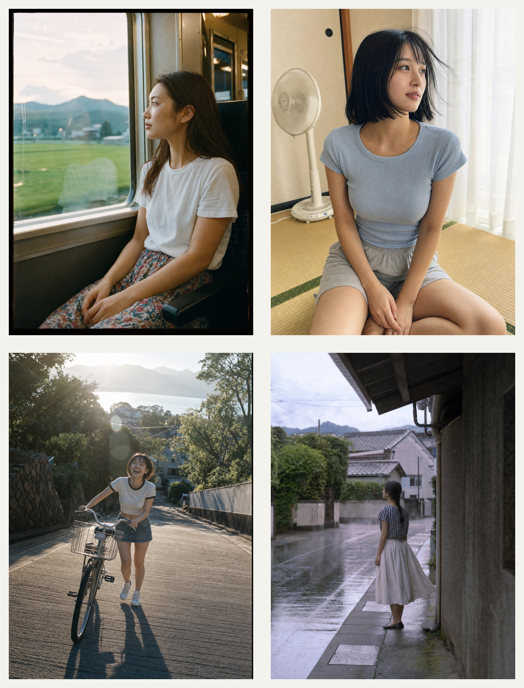

### 同一カード3枚

小さな可変要素だけで見た目が変わるかを確認するため、比較しやすいCard2
（畳・白いカーテン・扇風機）を固定し、3組を診断生成した。この3枚はランダム分布へ含めない。

| 画像 | 固定した追加要素 |
|---|---|
| D1 | A1 / C1 / R1 / T1 |
| D2 | A3 / C3 / R2 / T2 |
| D3 | A4 / C4 / R3 / T1 |

3アンカーは9項目中8項目が一致、1項目が部分一致、矛盾0。
D1・D2・D3の全ペアで顔・髪色・髪の動き・質感のうち2軸以上の差を目視できた。
特にD1とD2は4軸すべてが明確に異なった。一方、R2の「動作中」とR3の「動作後」は
どちらも髪がなびくため、一枚の静止画では最も差が弱かった。C4のアッシュ感も弱めだった。
赤・橙・マゼンタの画面端モヤは0/3。

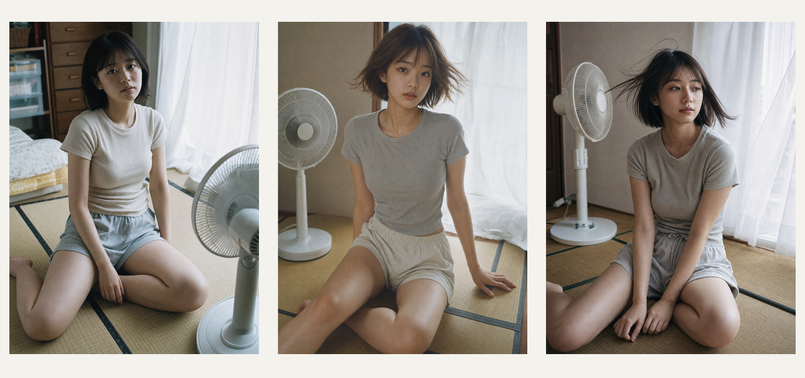

### 実生成から加えた修正と回帰確認

上の弱点を受け、最終文面へ次を追加した。

- C3/C4は黒やダークブラウンへ戻さず、中明度のベージュ／アッシュと明記
- R1/R2/R3はカードの主動作と視線を止めず、動きの振幅だけを変える
- 全方式・全カードで自然なカラー写真を固定し、白黒・モノクロ・グレースケール・単色セピアを使わない
- Card6は斜め前または真横、人物は3分の1以下、背中を向けないと明記
- 選択したA/Cを具体文へ置換し、R/Tも統合してから画像モデルへ渡す
- ハレーションを実在明部へ局所化し、フレアを無色から淡い白へ限定

修正後にCard2を1枚、Card6を2枚、ランダム集計外で回帰生成した。

- Card2: カラー写真になり、中明度のアッシュブラウンも目視できた
- Card6 1回目: 雨が止んだ後の横〜斜め前へ改善したが、人物高37.4%で3分の1以下には届かなかった
- Card6 2回目: 目標を画面高の約4分の1へ強め、人物高約31.6%で3分の1以下を満たした
- 赤・橙・マゼンタの画面端モヤ: 0/3

次の一覧は左からCard2、Card6 1回目、Card6 2回目。

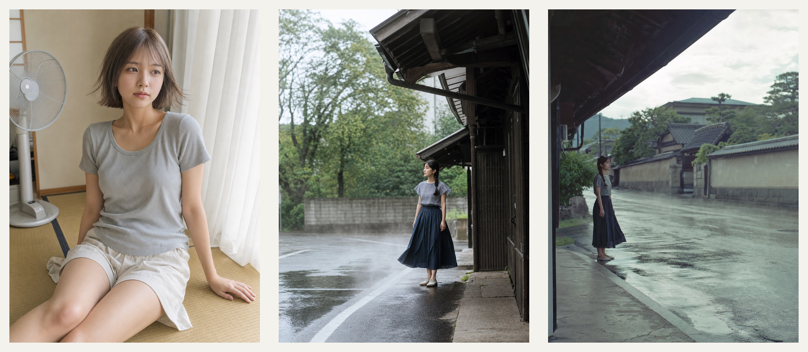

採用画像はランダム4枚、同一カード診断3枚、回帰3枚の計10枚。
すべて1086×1448の3:4縦位置かつカラー写真で、赤い画面端モヤは0/10だった。
白黒の初回出力1枚は不採用として、この10枚には含めない。

## 結論（8カード・旧4軸時点）

- 直接投げ版は1ブロックを維持する。ユーザーに別プロンプトやレーンを選ばせない。
- 8カード全部を低レベル画像モデルへ渡さず、チャットAIが骨格カード1枚とA/C/R/T各1つへ絞ってから画像生成する。
- 同じ会話で同じブロックを繰り返すと、過去画像を使ったshuffle bagで即時反復を抑えられる。
- 同一カード3枚でも、マクロ骨格を保ったまま顔・髪色・瞬間・質感の差を目視できた。
- 遠景では顔差が判定不能になり、動作中／動作後も静止画では差が縮むため、追加4軸は補助的な幅として扱う。
- すべての方式で自然なカラー写真を固定し、白黒・モノクロ・グレースケールは採用しない。
- 赤い光漏れと色付きの画面端モヤは候補から外し、今回の追加10枚でも再発しなかった。
- 厳密な再現性が必要なメタプロンプト側では、修正済みの明示seed方式を使う。

このハイブリッド方式は、1ブロック直投げという制約の中では、
カード間混合を防ぎながら同じカード内の反復も減らせる実用的な妥協点になった。
ただし、今回も小規模なスモークテストであり、真の一様乱数や画像モデル全体の
母集団分布を証明するものではない。過去画像を参照できない新規会話では、
初回選択に偏りが残り得る。

## 7. 現行random2人物軸への同期後（2026-07-31）

`season/summer.md` へ Q/A/A-2/B/C を同期した後、1ブロック直投げの処理境界を再現して4枚生成した。
カードとAは別々のシャッフルバッグから未使用候補を抽選し、Q/A-2/B/C/R/Tは独立抽選。
見栄えを理由に選び直さず、画像生成ツールには選択済みの1枚分だけを渡した。

| 画像 | 抽選結果 |
|---|---|
| S1 | Card3 / Q1 / A4 / A-2-6 / B5 / C4 / R2 / T2 |
| S2 | Card8 / Q1 / A5 / A-2-8 / B4 / C3 / R2 / T1 |
| S3 | Card6 / Q2 / A6 / A-2-7 / B3 / C1 / R1 / T2 |
| S4 | Card1 / Q2 / A2 / A-2-2 / B1 / C4 / R1 / T1 |

観察結果:

| 軸 | 結果 |
|---|---|
| カード | 4種、再利用0/4、他カード要素の混在0/4 |
| 夏の保持 | 祭りの青い時間 / お盆の縁側 / 夕立後 / プールサイドの4/4で明確 |
| 3アンカー | 12項目中10項目一致、カード3の距離が部分一致、カード6初回の距離が不一致 |
| 人物差 | 顔・体格・髪色の組み合わせは4枚とも別。正確な年齢や遠景の顔差は画像だけでは判定不能 |
| 色 | 自然なカラー4/4、白黒0/4 |
| 色付き画面端モヤ | 赤・橙・マゼンタとも0/4 |

カード6初回は、人物が画面高の約4割まで寄り、既知の距離アンカー違反が再発した。
そこでカード6だけ「20m以上離す」「人物高を5分の1〜4分の1」「環境が画面の大半」
へ強め、同じQ/A/A-2/B/C/R/Tのまま1枚を回帰生成した。
再生成では人物が約4分の1まで小さくなり、軒下と道路が主役の環境構図へ改善した。
自然色を保ち、色付きの画面端モヤも出なかった。

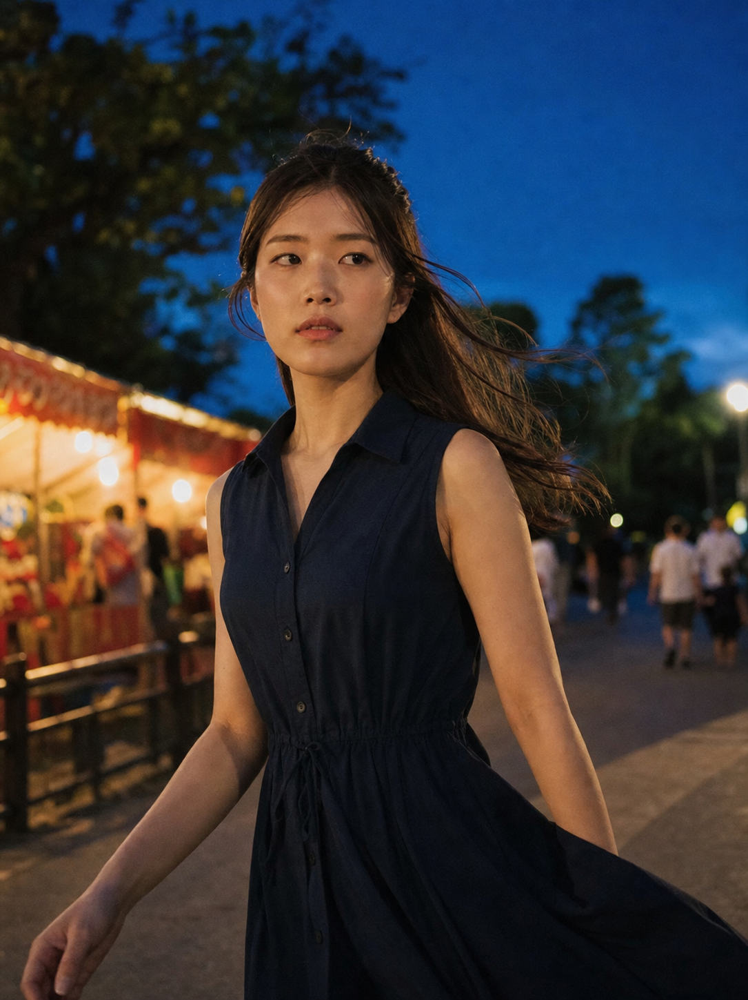

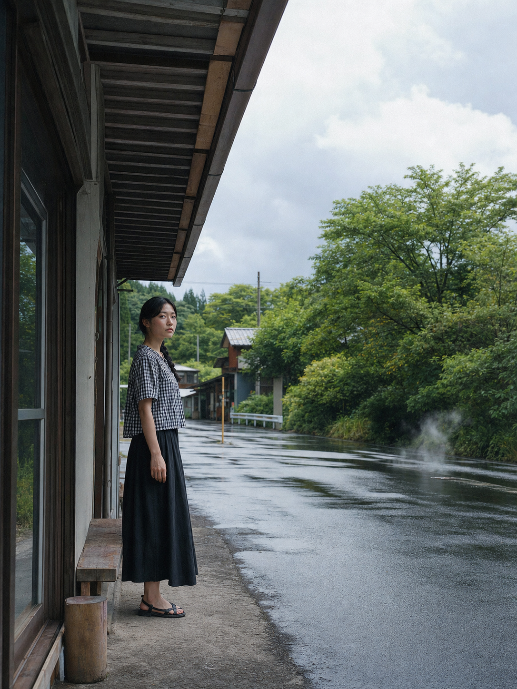
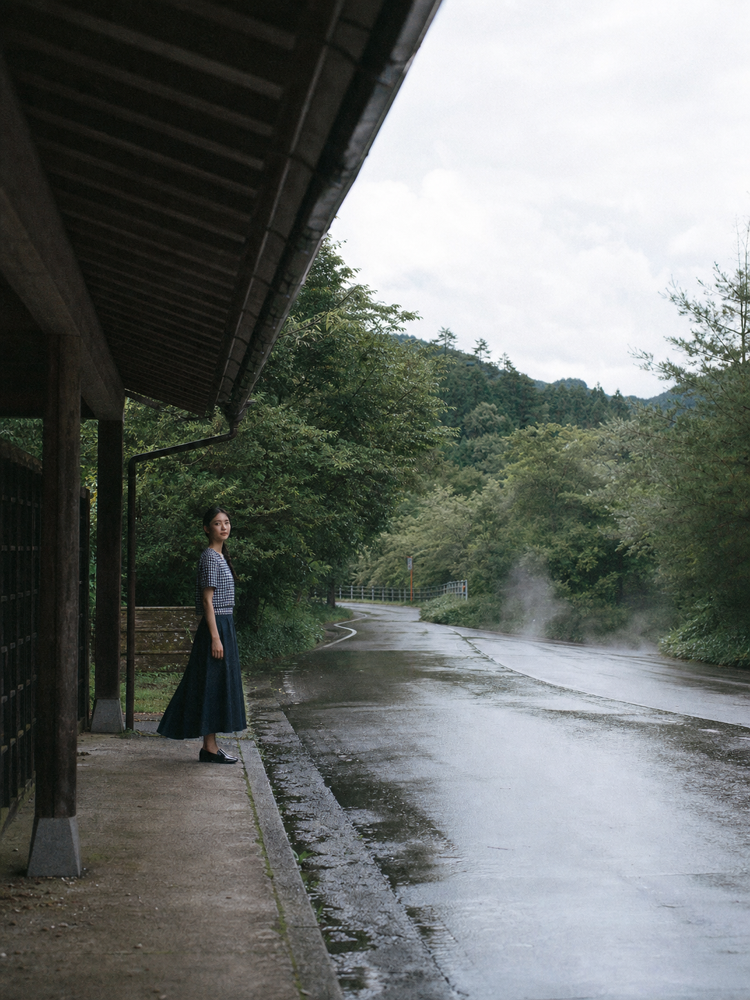

4枚は現行人物軸の描画可能性とカード境界を確認するスモークテストであり、
393,216状態の分布や、チャットモデルの初回選択が一様であることを証明するものではない。

## 8. キャミソール・ビキニ追加後（2026-07-31）

夏服Fへキャミソール＋リネンパンツとビキニを追加し、直投げ版へCard9・Card10を追加した。
ビキニは23〜26歳の成人、昼間の公共レジャー場面、引きの環境構図に限定し、
ほかのカードへ水着が混ざらない完成カードとして扱う。

Card9の初回生成は、服・海辺・自然色は一致したが、日除けへ向かう動作に引っ張られて
背面3/4構図になった。そこでカード本文を、カメラを進行方向の前方へ置き、
正面または斜め前から顔と全身を写す指定へ修正した。同じ服装と場面で再生成すると、
顔の見える正面寄りの全身環境構図へ改善した。

Card10は、キャミソールトップとワイドリネンパンツが別々の服として明確に描かれ、
海辺のテラス、日除け、海風を含む夏の昼の場面になった。

| 画像 | 服装・場面 | 構図 | 自然色 | 色付き画面端モヤ |
|---|---|---|---|---|
| Card9 初回 | 一致 | 背面3/4のため不採用 | 適合 | なし |
| Card9 修正後 | 一致 | 正面寄り全身・海辺の環境構図 | 適合 | なし |
| Card10 | 一致 | 斜め前だが、膝上指定より広い全身寄りで部分一致 | 適合 | なし |

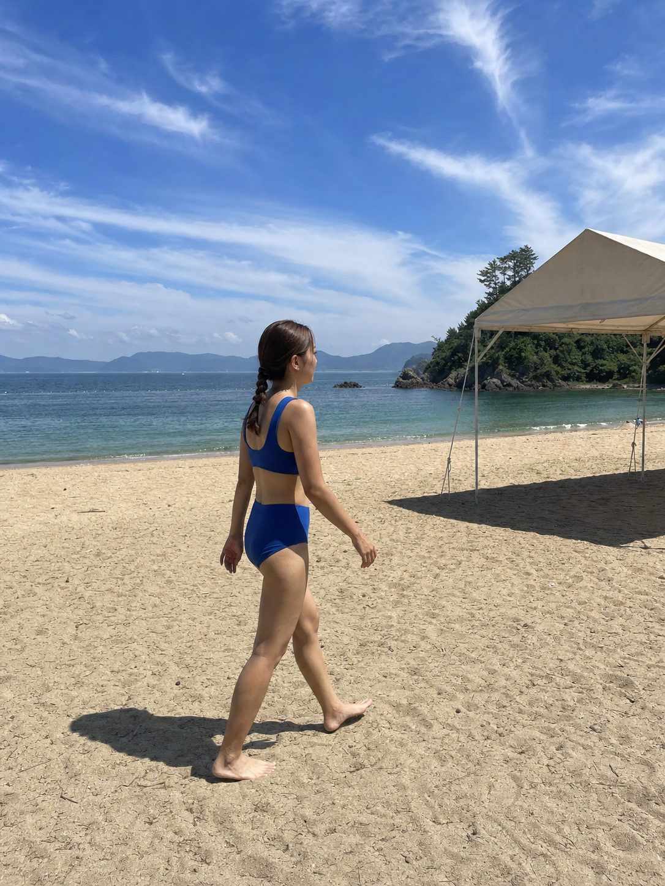
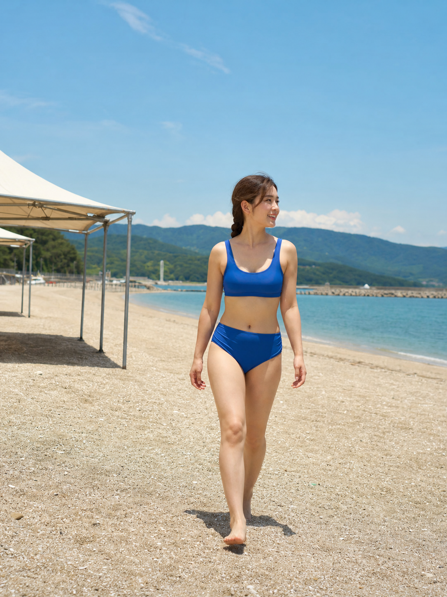
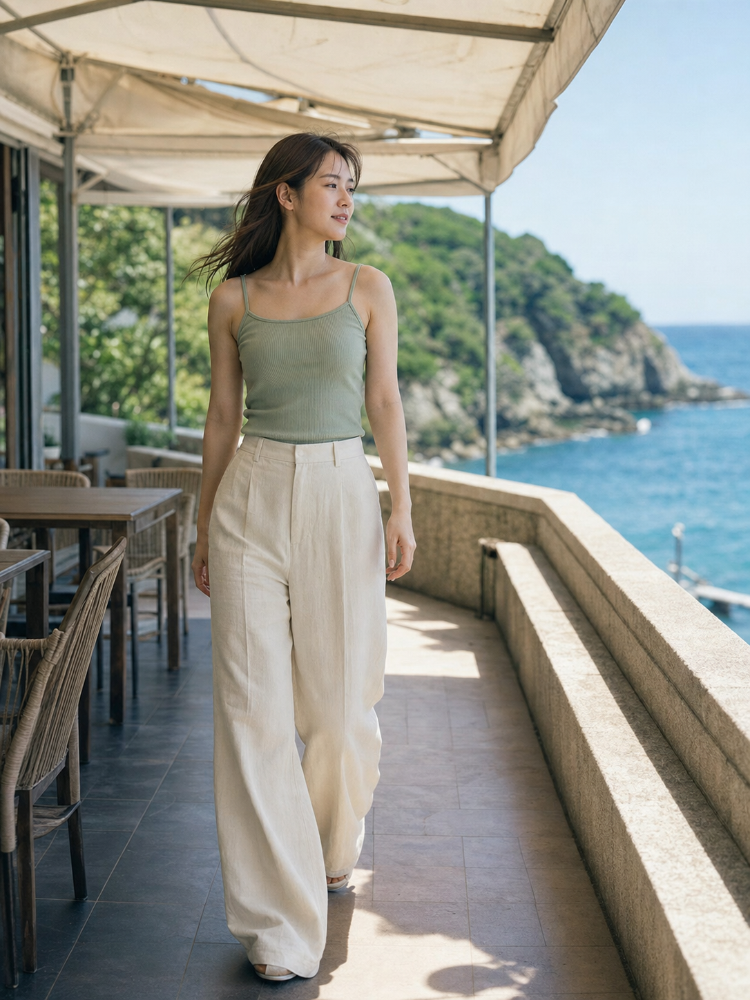

この3枚は新しい服装カードの描画可能性を確かめる回帰テストであり、
10カード491,520状態の選択分布を測るものではない。

## 9. Card1再偏りとSUMMER10-BAG-v3（2026-07-31）

10カード化後も、1ブロック・サイレント抽選版からCard1が高頻度で出るという
実利用上の報告があった。報告画像は、プール＋大きな入道雲、
ストライプのボートネックTシャツ＋白ショーツ、正面寄りの全身環境構図、
高いポニーテールがそろっており、カード混在ではなくCard1そのものの再選択だった。

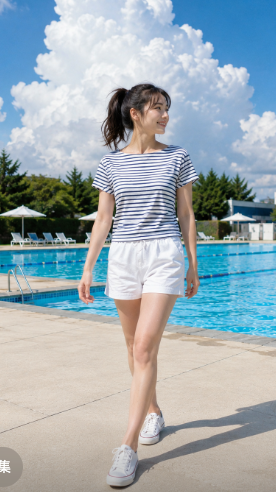

過去の検証でも、全カードを低レベル画像モデルへ渡したときはCard1が3/4、
旧サイレント版の新規コンテキスト初回はCard1が2/4だった。
旧版の「等確率として内部抽選」「偏りなく並べ替え」は実乱数源ではなく、
同じ会話での直前重複には効いても、新規会話の先頭選好を除けなかった。

当時の版は抽選器を `SUMMER10-BAG-v3` とし、1ブロックを維持したまま次へ変更した。

1. カード本文を評価する前に、番号だけを確定する。
2. 同じ会話では各カードの使用回数を数え、最少使用回数のIDだけを候補にする。
3. 実行可能な乱数機能があれば、本文を渡さず数値配列だけから選ぶ。
4. 乱数機能がなく履歴がある場合は、非逐次の固定巡回で最少使用候補を選ぶ。
5. 履歴も乱数もない場合は、8桁の非公開チケットを剰余へ変換する。
   これは先頭選好を拡散するフォールバックであり、新規会話間の一様性は保証しない。
6. 画像生成ツールへ渡す直前に、選択カード1枚の3アンカーだけがあり、
   未選択候補や抽選指示が残っていないことを検査する。

### 機械検証

| 検証 | 結果 |
|---|---|
| 暗号学的乱数で10万回の初回抽選 | Card1〜10は `10044, 10021, 10206, 9955, 9974, 9899, 9998, 9996, 10014, 9893` |
| 履歴なし初回がCard6だった場合の、その後を含む固定巡回10回 | `6, 9, 2, 5, 8, 1, 4, 7, 10, 3`。10種すべて1回 |
| 固定巡回100回後 | 各カード10回、最多と最少の差0 |
| Card1だけ使用5回、ほか0回の履歴 | 次回候補はCard2〜10。Card1は候補外 |
| Markdown構造 | コードフェンス14個で対応、Card1〜10を各1つ検出 |

暗号学的乱数の10万回は実装経路のスモークテストであり、
外部チャット製品の内部乱数分布を測ったものではない。

### 選択済み1カード境界での実生成

実行環境の乱数で、最少使用候補から6回連続で抽選した。
画像生成ツールには各行の選択済み1カード分だけを渡し、候補一覧は渡していない。

| 画像 | 選択結果 | 場所 | 服 | 距離 |
|---|---|---|---|---|
| V1 | Card3 / Q4 / A3 / A-2-6 / B6 / C3 / R1 / T1 | 一致 | 一致 | 一致 |
| V2 | Card1 / Q1 / A2 / A-2-3 / B5 / C3 / R2 / T2 | 一致 | 一致 | 一致 |
| V3 | Card8 / Q4 / A8 / A-2-6 / B5 / C1 / R2 / T2 | 一致 | 一致 | 一致 |
| V4 | Card7 / Q3 / A4 / A-2-4 / B8 / C4 / R2 / T1 | 一致 | 一致 | 一致 |
| V5 | Card6 / Q1 / A5 / A-2-6 / B1 / C1 / R3 / T1 | 一致 | 一致 | 不一致。人物が目標の画面高1/4より大きい |
| V6 | Card5 / Q2 / A7 / A-2-5 / B7 / C3 / R1 / T2 | 一致 | 一致 | 一致 |

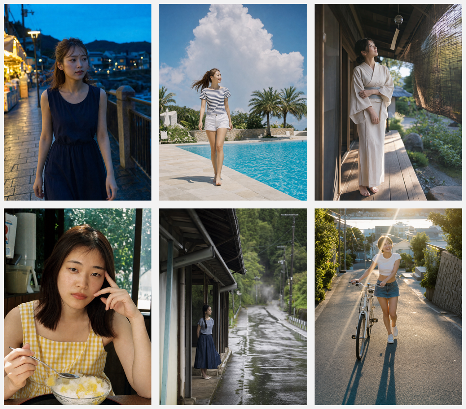

観察結果:

- 選択カードは6種、重複0/6、Card1は1/6
- 場所・服は12/12一致、距離は5/6一致、他カード要素の混在0/6
- 夏の場面は6/6で明確
- 自然なカラー6/6、白黒0/6
- 赤・橙・マゼンタの画面端モヤ0/6

Card6の距離違反は、選択IDや全候補漏れではなく、選択後に画像モデルが
遠景指定より人物を大きく描いた別問題である。今回のCard1頻度修正とは分けて残す。

この6枚で確認できたのは、実乱数と選択済み1カードだけを渡す経路では
Card1へ収束せず、画像側も選択カードを混ぜないことまでである。
実際のChatGPT / Geminiの新規会話初回が一様になることは未証明。
また、nano-bananaなどの低レベル画像モデルへ10カード全文を直接渡すUIでは、
画像モデル自身が抽選器を実行できないため、この方式でも均等性は保証できない。

## 10. Google Flow / ChatGPT一発生成の再検証（2026-08-01）

実利用では、Google FlowやChatGPTの新規チャットへ②を毎回1回だけ貼ると、
Card1のプール、ボーダーTシャツ、白いショーツ、高いポニーテールが高頻度で再発した。
9節の6枚は、実行環境の乱数で先にIDを決め、選択済み1カードだけを画像生成へ渡した
回帰テストであり、ユーザーの実際の一発入力を再現していなかった。

同じ静的プロンプトには外部エントロピーがない。チャット層が抽選手順を実行せず、
ブロック全体を画像モデルへ渡す経路では、暗号学的乱数、履歴、非公開数字、剰余、
カードIDを文章で要求しても真の抽選にはならない。さらに、完成カード方式では
一つの選択偏りが場所・服・髪・構図・光のすべてへ同時に広がる。

そこで旧抽選器を削除し、最初の`random/inline-random.md`と同じ構造へ戻した。

- 顔、体型、髪、シーン束、カメラの5リストだけにする
- シーン束は服・場所・動作・光だけを一組にし、髪と撮影距離は別軸にする
- 乱数、使用回数の累積履歴、固定巡回、多桁チケット、状態数の表記を置かない
- 白黒禁止と赤・橙・マゼンタのモヤ禁止は末尾へ1回だけ置く

### 段階テスト

すべてCodex組み込み画像生成へ、各時点の②コードブロックを変更せず独立に渡した。
外部でシーンを選んだ生成は含めていない。

| 版 | 成功画像 | 観察結果 | 判定 |
|---|---:|---|---|
| 自由発明型 | 3 | 白いノースリーブ、暗色のまとめ髪、古い家または海辺、中距離が3/3 | 不採用 |
| 16シーン、ビキニ記述2回 | 6 | 青いビキニと海辺が6/6 | 不採用 |
| 16シーン、ビキニ記述1回 | 6 | ビキニ4、かき氷店1、桟橋1 | 不採用 |
| 15シーン、ビキニなし | 6 | 桟橋2、無人駅3、台風前の川辺1 | 採用 |

ビキニ入りの試行では、上表とは別に1回、画像出力段階の安全判定で停止した。
生成成功だけを数えた2版合計でも、ビキニは10/12だった。記述の重複を除くだけでは
過半数の収束が残ったため、②からだけビキニ場面を外した。ビキニは
①のDynamic Prompts版とAのメタプロンプト版には残している。

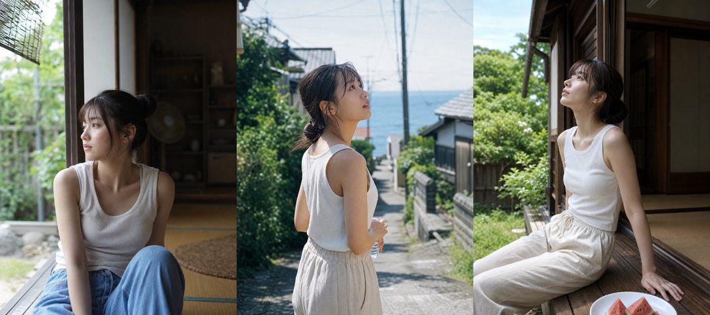

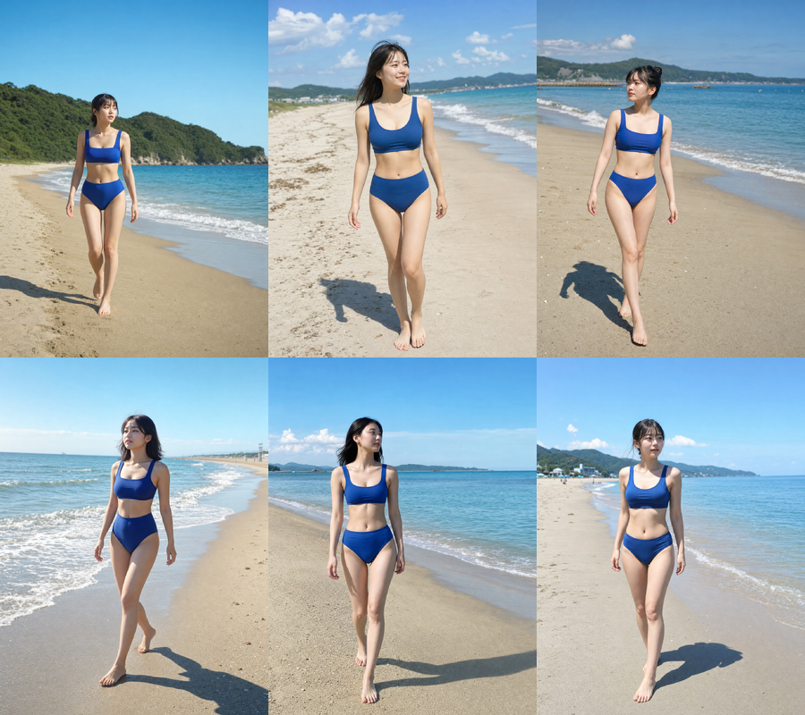

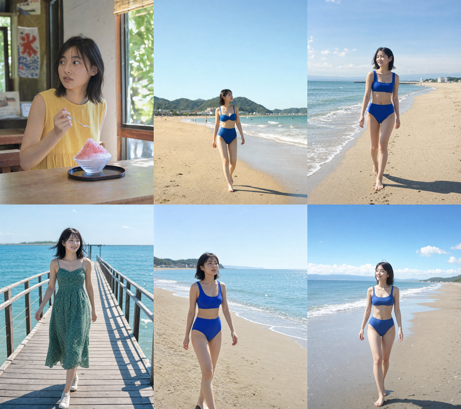

### 採用版6枚

| 軸 | 結果 |
|---|---|
| シーン | 3種。桟橋2/6、無人駅3/6、台風前の川辺1/6 |
| 服装 | 緑のサンドレス2/6、淡色トップ＋花柄ロングスカートまたはワンピース3/6、ノースリーブブラウス＋オリーブのワイドパンツ1/6 |
| 撮影距離 | 全身4/6、座り中距離1/6、背景を広く含む膝下まで1/6。人物を小さく置く遠景は0/6 |
| 髪 | 黒〜暗色の肩丈付近が6/6。独立リストの残存偏り |
| 色 | 自然なカラー6/6、白黒0/6 |
| 色付き画面端モヤ | 赤・橙・マゼンタとも0/6 |

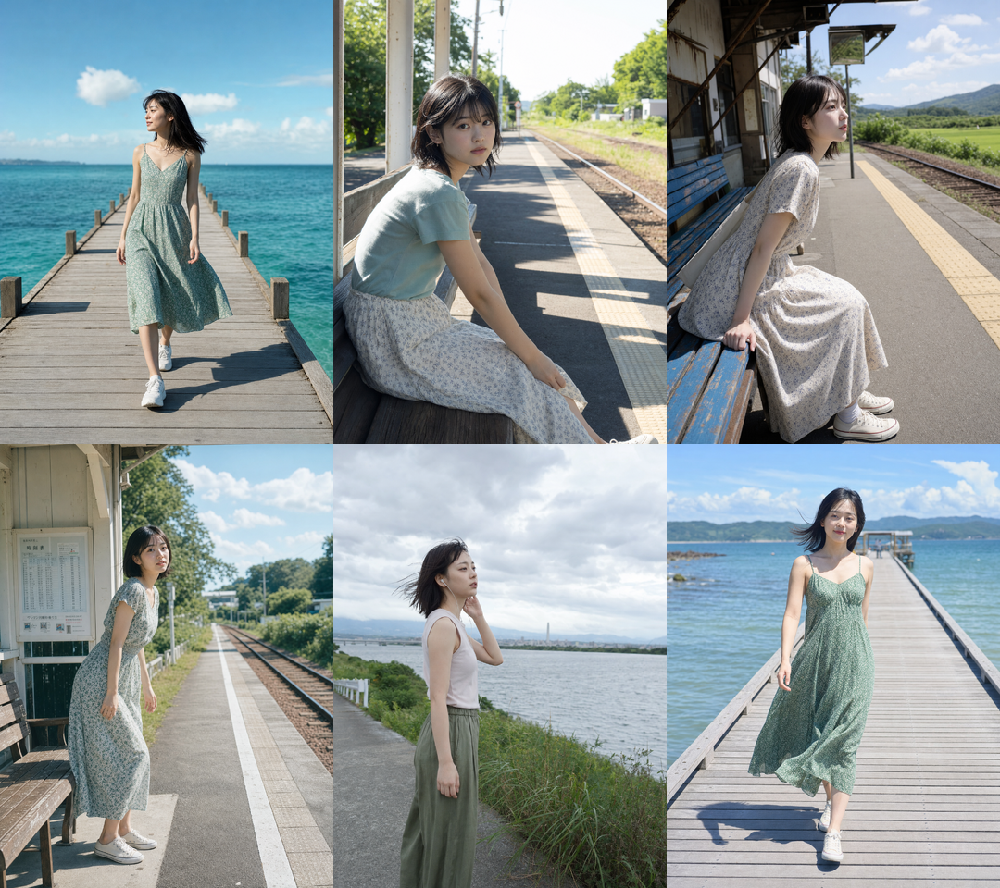

採用版は、旧Card1やビキニへの4/6〜6/6収束を解消し、6枚で3場面へ分散した。
一方で無人駅3/6と暗色の肩丈ヘア6/6は残るため、均等抽選や完全解決とは呼ばない。
同一の静的1ブロック、新規会話、1枚生成を同時に維持する限り、真の一様性は作れない。
この条件内では、抽選器を装うより、短いシーン束と独立軸で偏りが画像全体へ
連動する範囲を小さくする方針を採用する。
